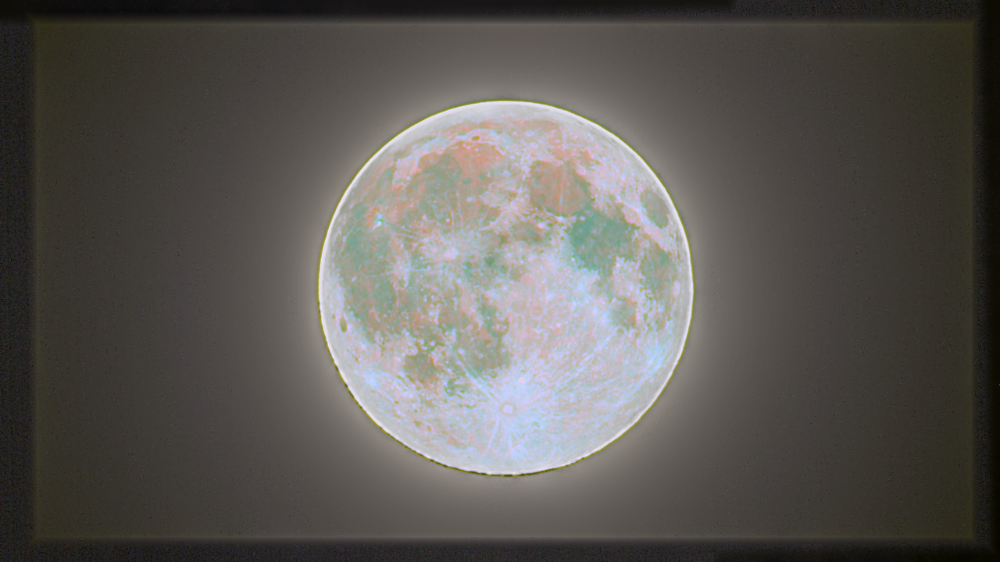

# Lunar HDR Studio

[English](README.md)

Lokálna desktopová aplikácia pre skladanie dvoch alebo viacerých expozícií Mesiaca a tvorbu vzhľadu **Mineral Moon**. Verzia **0.4.0** podporuje FITS, ľubovoľný počet expozícií, hviezdne pozadie, vlastný podpis a orez obrázka. Fotografie sa nikam neposielajú. Rozhranie je v slovenčine.



Skutočný fotografický príklad: expozičná fúzia FITS snímok Mesiaca s presetom Mineral Moon a ručnou úpravou zobrazovacej expozície −0,5 EV. Pôvodné FITS súbory sa v repozitári nezverejňujú. Táto fotografia je oddelená od procedurálnej ukážky pribalenej v aplikácii.

## Rýchly štart

**Hotové aplikácie:** stiahni ZIP pre svoj systém zo sekcie [Releases](https://github.com/Kwispy232/lunar-hdr-studio/releases). Na Macu otvor `LunarHDR.app`; Python nie je potrebný. ZIP balíky pre macOS Apple silicon, macOS Intel, Windows x64 a Linux x64 sú dostupné aj medzi artefaktmi úspešných [zostavení v GitHub Actions](https://github.com/Kwispy232/lunar-hdr-studio/actions/workflows/build.yml).

**Klonovanie a spustenie na vlastnom počítači:** nainštaluj Git a [Python 3.11–3.14](https://www.python.org/downloads/), potom naklonuj repozitár:

```sh
git clone https://github.com/Kwispy232/lunar-hdr-studio.git
cd lunar-hdr-studio
```

V tomto priečinku spusti príkaz pre svoj systém:

**Windows — PowerShell alebo Command Prompt**

```powershell
.\run.bat
```

Súbor `run.bat` môžeš spustiť aj dvojklikom. Spúšťač použije Python launcher `py`, ak je dostupný, inak príkaz `python` z PATH.

**macOS — Terminál**

```sh
bash run.command
```

Súbor `run.command` môžeš otvoriť aj dvojklikom vo Finderi.

**Linux — Terminál**

```sh
sh run.sh
```

Spúšťače nájdu podporovaný Python, vytvoria lokálne prostredie `.venv` a nainštalujú pripnuté závislosti. Na prvé spustenie treba internet; pri ďalšom spustení sa pip nespúšťa, pokiaľ verzie závislostí sedia. CI používa Python 3.11. Python 3.15 pripnutá verzia Qt nepodporuje. Prípravu prostredia bez otvorenia aplikácie overíš pridaním `--check` k príkazu spúšťača. Pri neúplnom alebo nepodporovanom `.venv` tento priečinok premenuj a spúšťač zopakuj; tvoje snímky to nemení. Na Linuxe treba grafické prostredie a systémové knižnice Qt/X11 alebo Wayland; napríklad Ubuntu môže potrebovať `libxcb-cursor0` a `libxkbcommon-x11-0`.

Pripnuté binárne závislosti cielia na moderné systémy: macOS 13+, Windows 10/11 a Linux x86_64 s glibc 2.34+ (napríklad Ubuntu 22.04+). Verzia 0.4.0 prešla testami, zostavením aj kontrolou spustenia hotového balíka na všetkých štyroch uvedených cieľoch. Interaktívne odskúšanie aplikácie prebehlo na macOS; úspešné CI zostavenie nenahrádza vizuálne odskúšanie na cieľovom počítači.

Ak chceš prostredie pripraviť ručne, spusti nasledujúce príkazy v naklonovanom repozitári. Aktivácia prostredia nie je potrebná.

**Windows:**

```powershell
py -3.11 -m venv .venv
.venv\Scripts\python.exe -m pip install -r requirements.txt
.venv\Scripts\python.exe main.py
```

**macOS / Linux:**

```sh
python3 -m venv .venv
.venv/bin/python -m pip install -r requirements.txt
.venv/bin/python main.py
```

## Pracovný postup

1. Načítaj dve alebo viac fotografií. Ďalšie môžeš pridávať do zoznamu, jednotlivé snímky nahradiť alebo odstrániť. Ako referenciu vyber ostrý, dobre exponovaný záber; určuje výsledný výrez a rozmery.
2. Nastav rozdiely EV voči referenčnému záberu. Pri dostupnom expozičnom čase v každom FITS sa predvyplnia z hlavičiek. Napríklad časy 1/1000, 1/250 a 1/60 s pri rovnakom ISO a clone približne zodpovedajú −2, 0 a +2 EV. Pri chýbajúcich údajoch nastav EV ručne; predvolené nuly nie sú odhadom skutočnej expozície. Z JPEG EXIF sa časy automaticky nezisťujú.
3. Vyber HDR alebo expozičnú fúziu a spusti zarovnanie a skladanie. Skontroluj diagnostiku zarovnania; pri neistej registrácii použi ručné doladenie.
4. Vyskúšaj **Mineral Moon**, prípadne uprav saturáciu, teplotu, kontrast, detaily a ďalšie posuvníky. Porovnaj výsledok s vybranou referenčnou snímkou.
5. V časti **Dokončenie** dole v pravom paneli uprav pozadie: ponechaj pôvodné hviezdy, potlač malé svetlé body alebo pridaj syntetické hviezdy ako vizuálny efekt. Tieto voľby nemenia pôvodné súbory.
6. Vyber orez myšou a podľa potreby zapni vlastný textový podpis. Orez môžeš zrušiť a podpis upraviť.
7. Exportuj hotový obrázok ako PNG/JPEG alebo 16-bit TIFF. Pre ďalšie HDR spracovanie exportuj lineárny súbor Radiance `.hdr`.

## Čo jednotlivé režimy robia

**HDR z bežných obrázkov** linearizuje vstupné sRGB farby, zohľadní zadané EV a vážene spojí expozície. Výstup v plávajúcej desatinnej čiarke zachováva hodnoty nad 1. Náhľad používa mapovanie tónov. Ide o relatívne HDR pri predpoklade sRGB odozvy, nie o kalibráciu senzora alebo presné meranie jasu.

**HDR z FITS** používa pôvodné lineárne vzorky po aplikovaní FITS mierky `BSCALE/BZERO`. Kontrast náhľadu nemení dáta použité na skladanie. Časy `EXPTIME` umožnia prepočet intenzity na jednotku času; vstupy už označené ako intenzita za sekundu sa nedelia časom znova. Zábery musia mať zlučiteľné jednotky a kalibráciu. Podporované sú ADU, DN, counts a elektróny/fotóny aj ich hodnoty za sekundu; iné kalibrované jednotky, napríklad Jy/sr, treba najprv previesť alebo použiť vizuálnu fúziu. Automatický odhad EV predpokladá rovnaký gain, clonu a filtre. Pri pomere časov nad 1000× aplikácia zobrazí upozornenie na kontrolu normalizácie. Pri už jasovo normalizovaných stackoch skontroluj ručne EV; celkový integračný čas nemusí vyjadrovať rozdiel jasu uložených pixelov. Bežné sRGB obrázky a FITS s fyzikálnymi jednotkami nespájaj do jedného rádiometrického HDR; na vizuálne spojenie použi expozičnú fúziu.

**Expozičná fúzia** spája použiteľné oblasti expozícií do zobraziteľného obrázka. Tento režim nie je lineárny HDR a nemá export HDR radiancie. Rozdiel medzi HDR a expozičnou fúziou vysvetľuje aj [dokumentácia OpenCV](https://docs.opencv.org/4.12.0/d2/df0/tutorial_py_hdr.html).

**Mineral Moon** zvýrazňuje existujúce farebné rozdiely. Posuvník **Neutralizácia farieb** najprv vyváži priemerný farebný nádych jasnej časti disku; predpokladá približne neutrálny Mesiac a dá sa znížiť alebo vypnúť. Preset Mineral Moon ho zapína, aby nezosilňoval iba celkový žltý či zelený nádych vstupu. Nevytvára skutočné farebné informácie z monochromatickej snímky a nie je mineralogickou analýzou. Kvalitu ovplyvní farebný šum a vyváženie bielej. Množstvo okolitej žiary riadi zvolená zostava expozícií. Mineral Moon sa sústreďuje na farebné rozdiely a detaily povrchu; potlačenie pozadia zostáva samostatnou, voliteľnou úpravou v časti Dokončenie.

PNG/JPEG/TIFF obsahujú úpravy z posuvníkov, zvolené hviezdne pozadie, orez a podpis. Radiance HDR obsahuje celé základné lineárne zlúčenie, bez kreatívnych úprav, orezu, podpisu a mapovania tónov. Pridané hviezdy sú deterministický vizuálny efekt, nie zaznamenané astronomické objekty. Potlačenie hviezd je odhad malých svetlých bodov mimo disku, preto skontroluj náhľad.

Exportný dialóg začína v absolútnej ceste priečinka Obrázky (prípadne v domovskom priečinku). Po úspešnom exporte si počas otvorenej relácie pamätá zvolený priečinok. Chyba zápisu zobrazí konkrétny cieľ a vysvetlenie; výsledok ostáva pripravený na opakovaný export.

## Vstupy a praktické hranice

- JPEG, PNG a TIFF; 8-bit a 16-bit vstupy, RGB aj odtiene sivej.
- FITS (`.fits`, `.fit`, `.fts`, aj gzip a `.fits.fz`): 2D monochromatické snímky a RGB obrazové polia. Použije sa prvá obrazová HDU, vrátane obrazového rozšírenia a komprimovanej HDU. Podporované sú celočíselné aj plávajúce hodnoty a FITS škálovanie; pracovné obrazové polia používajú float32.
- Úroveň saturácie FITS sa číta zo `SATURATE`/`SATLEVEL`/`SATURLEV`, inak sa pri celočíselných dátach použije strop úložného typu. Ak senzor saturuje skôr, správnu úroveň doplň do FITS hlavičky. Maximum plávajúcej snímky sa automaticky nepovažuje za prepálenie.
- Neplatné FITS vzorky (NaN/Inf/BLANK) sa maskujú. Záporné kalibrované vzorky sa neodsúvajú individuálnym pripočítaním konštanty; pri nezápornom HDR výstupe sa záporný výsledok oreže s upozornením. Spektrálne/časové kocky a 2D nevyvolané Bayer dáta sa nepovažujú za RGB; najprv ich vyvolaj alebo vyber obrazovú rovinu. Trojkanálové RGB exporty so zvyšným údajom BAYERPAT (napríklad DWARF) sa načítajú ako hotové RGB s upozornením, bez opakovaného debayerovania.
- Pre fotoaparátový RAW alebo SER najprv exportuj farebný TIFF. Pri exporte použi sRGB; plná správa ICC profilov a RAW vyvolávanie nie sú súčasťou tejto verzie.
- Zábery by mali zachytávať tú istú fázu Mesiaca krátko po sebe, s viditeľným diskom a spoločnými detailmi. Extrémny orez, mraky, slabý signál alebo úplné prepálenie môžu znemožniť automatické zarovnanie.
- Registrácia podporuje posun, mierku a otočenie. Nekompenzuje atmosférické chvenie jednotlivých oblastí ani stopy pohybujúcich sa hviezd.
- Detail prepálený vo všetkých záberoch nemožno obnoviť. Počet snímok nemá pevný limit v rozhraní; veľa záberov v plnom rozlíšení potrebuje adekvátnu RAM.
- Táto verzia nemá ukladanie a obnovu celých rozpracovaných projektov.

## Fotografia v dokumentácii a ukážka v aplikácii

**Obrázok Mineral Moon v tomto README je skutočný fotografický výsledok**, spracovaný z používateľových lunárnych FITS snímok. Pôvodné vstupné FITS súbory sa nezverejňujú.

**Ukážka v aplikácii je oddelená.** Dodané demo je pôvodný procedurálne vygenerovaný obraz s označením **SYNTHETIC DEMO**. Neobsahuje používateľove fotografie ani externú referenciu. Slúži na skúšanie registrácie a ovládania; nie je skutočnou fotografiou Mesiaca, mapou jeho povrchu ani mineralogickými dátami. Generátor je v `lunarhdr/publicdemo.py`, pôvod obrázkov opisujú [docs/IMAGES.md](docs/IMAGES.md) a [poznámky k pribaleným súborom](lunarhdr/assets/PROVENANCE.md).

## Samostatné aplikácie

V nasledujúcich príkazoch použi Python z lokálneho prostredia: na Windows `.venv\Scripts\python.exe`, na macOS/Linux `.venv/bin/python`, namiesto príkazu `python`.

```sh
python -m pip install -r requirements-dev.txt
python -m pytest -q
python build.py
```

Výsledok je v `dist/`. Samostatný balík sa zostavuje na cieľovom operačnom systéme a architektúre. Workflow `.github/workflows/build.yml` testuje a pripravuje macOS ARM, macOS Intel, Windows a Linux buildy pri pushi do `main`, pull requeste alebo manuálnom spustení. **Overenie 0.4.0:** [všetky štyri platformy prešli](https://github.com/Kwispy232/lunar-hdr-studio/actions/runs/36310250413) testami, zostavením aj spustením aplikácie s načítaním ukážky. Na macOS a Linuxe prešlo 113 testov; na Windowse 112, pretože má jeden spúšťač namiesto dvoch unixových. Úspešne prešlo aj anonymné klonovanie, inštalácia a spustenie na macOS s Pythonom 3.14.2. ZIP archívy sú medzi artefaktmi úspešných behov. Runner platformy vychádzajú z [dokumentácie GitHub](https://docs.github.com/en/actions/reference/runners/github-hosted-runners). [Qt for Python](https://doc.qt.io/qtforpython-6.8/deployment/index.html) podporuje tieto tri desktopové platformy.

Mac balík je lokálny vývojový build bez Apple Developer notarizácie. Lokálne a CI overenia opisuje `VALIDATION.md`; dokončenie buildu nenahrádza vizuálne odskúšanie na cieľovom počítači.

## Technológie

Python, PySide6/Qt, OpenCV, NumPy, Pillow, tifffile a Astropy. Verzie sú pripnuté v `requirements.txt`. FITS škálovanie a HDU čítanie používa [Astropy FITS](https://docs.astropy.org/en/stable/io/fits/usage/image.html). Qt/PySide sa používajú dynamicky; informácie o licenciách závislostí sú v ich distribúciách. Pribalené licenčné oznámenia sú v `lunarhdr/assets/licenses/`. Verejné buildy používajú tieto dynamické knižnice; Apple Developer notarizácia a podpis Windows nie sú nastavené.


## Licencia

Pôvodný zdrojový kód projektu je dostupný pod [licenciou MIT](LICENSE). Závislosti tretích strán si zachovávajú vlastné licencie; pribalené oznámenia sú v `lunarhdr/assets/licenses/`.

Fotografie, referenčné obrázky a ďalšie materiály majú samostatné práva a označenie pôvodu. Licencia MIT pre kód nemení licencie obrázkov tretích strán. Pôvod pribalených obrázkov opisuje `lunarhdr/assets/PROVENANCE.md`. Skutočný lunárny príklad v tomto README sa používa so súhlasom používateľa; pôvodné FITS snímky sa nepribaľujú.
